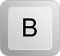
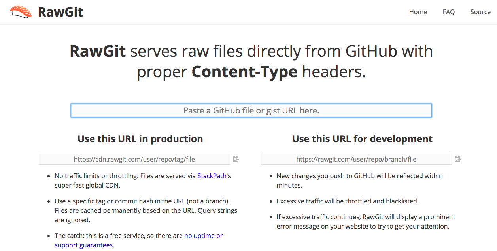

<!-- .slide: data-background="#FFFFFF" -->
<!-- .slide: data-color="#333333" -->

## Demo Slide web
MarkDown + Reveal.js  
2018-07-02 Infosons - Ezio Sperduto
---

<!-- .slide: data-background="#4D7E65" -->
<!-- .slide: data-color="#333333" -->

## Inizializzare le slide
1. creare repo o cartella su **GitHub**
2. caricare file testo vuoto **slide.md**
3. copiare file wrapper **index.html** che usa *Reveal.js* e punta a *slide.md*
4. mettere link-raw di *index.html* di GitHub su [https://rawgit.com/](https://rawgit.com/) per generare la presentazione
5. **lavorare su *slide.md* per ottenere la presentazione!!!**
---

## Formattazione
* *corsivo*  (asterisco singolo)  
```
*corsivo*
```
* **grassetto**  (asterisco doppio)  
```
**grassetto**
```
* ~barrato~  (tilde)   
```
~barrato~
```
*Esempio **che** combina* gli **stili** per ~ottenere~ un gran **risultato**.
---

## Intestazioni
Iniziare una riga con:  
**\#** equivale a marcare come `<H1>`  
**\##** equivale a marcare come `<H2>`  
**\####** equivale a marcare come `<H4>`  
---

## Link

- link automatici, basta scrivere http://www.link.it  
- link custom:  
```
[Testo mostrato](http://www.link.it)
```
e si ottiene [Testo mostrato](http://www.link.it)
---

## Citazioni

Si scrive così:
```
> C'era una volta
> in America...
```

per ottenere:
> C'era una volta  
> in America...
---

## Liste puntate
```
* Item 1
* Item 2
  * Item 2a
  * Item 2b
```
* Item 1
* Item 2
  * Item 2a
  * Item 2b

per la sottolista è necessario tabulare 
---

## Liste numerate
```
1. Item 1
2. Item 2
  * Item 2a
  * Item 2b
```
1. Item 1
2. Item 2
  1. Item 2a
  2. Item 2b

per la sottolista è necessario tabulare 
---

## Immagini
La sintassi è uguale al link, ma preceduta dal punto esclamativo:
```

```
  
---

## Regole extra

per andare **accapo** (*line-break*)  
lasciare due spazi `␣ ␣` a fine riga

---

## Regole extra

per aprire un **_nuovo paragrafo_**,  
lasciare una riga vuota
---

## Regole extra

il carattere `\` permette di fare *escape* dei caratteri speciali
---

## Regole extra

premere  oppure  per sospendere la presentazione
---

## Blocco di codice
 
* blocco *inline*, un solo backtick(Alt+96):
```
...sed eiusmod `CODICE` incidunt...
``` 
<span class="piccolo">
Lorem ipsum dolor sit amet, consectetur adipisci 
elit, sed eiusmod `CODICE` incidunt ut labore et dolore 
magna aliqua. Ut enim ad minim veniam, quis nostrum 
exercitationem `CODICE` ullam corporis suscipit laboriosam, 
nisi ut aliquid ex ea commodi consequatur. 
</span>

* per il blocco verticale occorre identificarlo con tre backtick  
<pre>
  <code class="hljs lasso">
      ```  
      blocco di codice 
      ```  
  </code>
</pre>
---

## Blocco di codice

* auto-highlight: specificare un linguaggio:
<pre>
  <code class="hljs lasso">
&#96;&#96;&#96;java
public interface Pippo{
  abstract int somma(int a,int b);
}
&#96;&#96;&#96;
  </code>
</pre>
per ottenere le parole chiave evidenziate:
```java
public interface Pippo{
  abstract int somma(int a,int b);
}
```
---
<!-- .slide: data-background="#FFFFFF" -->
<!-- .slide: data-color="#333333" -->
## Tabelle
Per le tabelle si usano **\| \- :**
```
Nome | Cognome | Telefono
------------ | :-------------: | ------------:
Steve | Jobs | 1234
Bill | Gates | 666
```
e il risultato è

Nome | Cognome | Telefono
------------ | :-------------: | ------------:
Steve | Jobs | 1234
Bill | Gates | 666

---

## HTML incorporato
E' possibile aggiungere HTML puro, e viene renderizzato correttamente:
```
<dl>
  <dt>Definition list</dt>
  <dd>Is something people use sometimes.</dd>

  <dt>Markdown in HTML</dt>
  <dd>Does *not* work **very** well. Use HTML <em>tags</em>.</dd>
</dl>
```
<dl>
  <dt>Definition list</dt>
  <dd>Is something people use sometimes.</dd>

  <dt>Markdown in HTML</dt>
  <dd>Does *not* work **very** well. Use HTML <em>tags</em>.</dd>
</dl>

---
## Linee orizzontali

E' sufficiente usare 3 o più asterischi:  
```
*********  
```
per ottenere  
*******  
---

## Animazioni / Fragments

Premi avanti...

<p class="fragment">... per attivare ...</p>

<span class="fragment">... una slide con </span> <span class="fragment">**fragments**</span><span class="fragment">!!!</span>
---

## Animazioni / Fragments

Tipi differenti di **fragments**:

<p class="fragment grow">ingradimento</p>
<p class="fragment shrink">rimpicciolimento</p>
<p class="fragment fade-out">scomparsa</p>
<p class="fragment fade-up">comparsa (da sopra, sotto, destra o sinistra)</p>
<p class="fragment current-visible">comparsa e scomparsa</p>
<p>Evidenziazione <span class="fragment highlight-red">rosso</span> <span class="fragment highlight-blue">blu</span> <span class="fragment highlight-green">verde</span></p>
---

## Animazioni / Fragments
Per aggiungere un **fragment**,   
mettere un tag **p** o **span** con classe  
**fragment**:
```
<p class="fragment">...</p>
<span class="fragment">...</span>
```
---

## Animazioni / Fragments
Altre classi valide:
- fragment grow
- fragment shrink
- fragment fade-out
- fragment fade-up
- fragment current-visible
...
---

## Transizioni
Vari effetti di transizione
Per la configurazione globale, impostare il parametro di inizializzazione `transition`.  
Per la singola slide aggiungere:
```
<!-- .slide: data-transition="zoom" -->
```
---

<!-- .slide: data-transition="zoom" -->
## Transizioni: zoom
---

<!-- .slide: data-transition="slide" -->
## Transizioni: slide
---

<!-- .slide: data-transition="convex" -->
## Transizioni: convex
---

<!-- .slide: data-transition="concave" -->
## Transizioni: concave
---

<!-- .slide: data-transition="fade" -->
## Transizioni: fade
---

<!-- .slide: data-background="#4D7E65" -->
<!-- .slide: data-color="#DDDDDD" -->
## Sfondo e colori

- colore sfondo: 
```
<!-- .slide: data-background="#4D7E65" -->
```
- colore carattere: 
```
<!-- .slide: data-color="#DDDDDD" -->
```
---

<!-- .slide: data-background="sea.jpg" -->
## Sfondo e colori

- immagine sfondo: 
```
<!-- .slide: data-background="http://.../img.jpg" -->
```
---

<!-- .slide: data-background="matrix.gif" -->
<!-- .reveal: data-color="#000000" -->

## Sfondo e colori

- gif e video: 
```
<!-- .slide: data-background="http://.../img.gif" -->
```
---

<!-- .slide: data-background="#f0f0f0" -->
<!-- .slide: data-color="#3b6cba" -->

## Slide verticali/annidate

  <section>
    <b><u>Prima annidata</u></b>  
    
  </section>
  <section>
    <b><u>Seconda annidata</u></b>  
    
  </section>
  <section>
    <b><u>Terza annidata</u></b>  
    
  </section>

---

## Temi
          <p>
            Esistono alcuni temi, con il CSS si possono presonalizzare a piacere<br>
            <!-- Hacks to swap themes after the page has loaded. Not flexible and only intended for the reveal.js demo deck. -->
            <a href="#" onclick="document.getElementById('theme').setAttribute('href','css/theme/black.css'); return false;">Black (default)</a> -
            <a href="#" onclick="document.getElementById('theme').setAttribute('href','css/theme/white.css'); return false;">White</a> -
            <a href="#" onclick="document.getElementById('theme').setAttribute('href','css/theme/league.css'); return false;">League</a> -
            <a href="#" onclick="document.getElementById('theme').setAttribute('href','css/theme/sky.css'); return false;">Sky</a> -
            <a href="#" onclick="document.getElementById('theme').setAttribute('href','css/theme/beige.css'); return false;">Beige</a> -
            <a href="#" onclick="document.getElementById('theme').setAttribute('href','css/theme/simple.css'); return false;">Simple</a> <br>
            <a href="#" onclick="document.getElementById('theme').setAttribute('href','css/theme/serif.css'); return false;">Serif</a> -
            <a href="#" onclick="document.getElementById('theme').setAttribute('href','css/theme/blood.css'); return false;">Blood</a> -
            <a href="#" onclick="document.getElementById('theme').setAttribute('href','css/theme/night.css'); return false;">Night</a> -
            <a href="#" onclick="document.getElementById('theme').setAttribute('href','css/theme/moon.css'); return false;">Moon</a> -
            <a href="#" onclick="document.getElementById('theme').setAttribute('href','css/theme/solarized.css'); return false;">Solarized</a>
          </p>
</section>---


## Formule con *KaTeX*

KaTeX è una versione web di LaTeX. 

La *funzione* $\Gamma(n) = (n-1)!,\forall n\in\mathbb N$ è   
soddisfatta da:

$$
\Gamma(z) = \int_0^\infty t^{z-1}e^{-t}dt\,.
$$

---

## Formule con *KaTeX*
- la codifica delle formule è la stessa di LaTeX
- formule inline, dollaro singolo
- formula blocco, dollaro doppio
```
\$\Gamma(n) = (n-1)!,\forall n\in\mathbb N\$
```
---

<!-- .slide: data-background="#FFFFFF" -->
<!-- .slide: data-color="#333333" -->
## Diagrammi con *mermaid*

<section class="diagram-slide">
    <span class="diagram-data" style="display:none;">
      graph LR
      A[Rettangolo] -- Arco --> B((Cerchio))
      A --> C(Rett.smussato)
      B --> D{Rombo}
      C --> D
     </span>
     <!-- Diagram will be displayed in this DIV -->
    <div class="diagram-display"></div>
</section>
---

<!-- .slide: data-background="#FFFFFF" -->
<!-- .slide: data-color="#333333" -->
## Diagrammi con *mermaid*

```
<section class="diagram-slide">
    <span class="diagram-data" style="display:none;">
      graph LR
      A[Rettangolo] -- Arco --> B((Cerchio))
      A --> C(Rett.smussato)
      B --> D{Rombo}
      C --> D
     </span>
     <!-- Diagram will be displayed in this DIV -->
    <div class="diagram-display"></div>
</section>
```
---

## Esportazione PDF

1. Aggiungi al link `?print-pdf` 
(http://localhost/slide.html/?print-pdf)
2. da Chrome: stampa -> 
3. pagina: **landscape**
4. margini: **none**
5. spunta: **Background Graphics**
6. **Salva come PDF.**
---

## Hosting / svil->prod

La presentazione può essere ospitata su un qualunque server:
- su **RawGit**: pubblico accessibile a tutti
- su locale: velocità in sviluppo
---

## Hosting: RawGit
Renderizza pagine su *GitHub*

---

## Hosting: locale
Usando *Docker*, si può  
lanciare al volo un webserver:
```
docker run --name slide -p 7777:80 
   -v $PWD:/usr/share/nginx/html:ro --rm nginx
```
e raggiungerlo:
```
IP-DOCKER:7777/demo.html
```
---

# Fine
grazie per l'attenzione
---

# Domande?
---

## Feedback anonimo
- link
- qr
- bozza feedback


